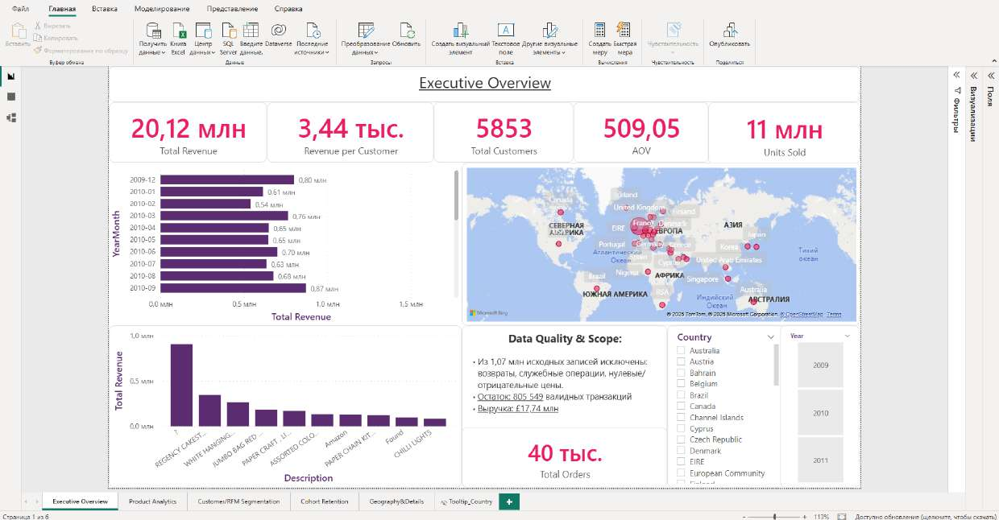

# Ekaterina Krasnyanskaya — BI / Data Analyst Portfolio

**Аналитик данных.** Превращаю сырые данные в дашборды, на которых бизнес принимает решения:
SQL → модель → DAX → визуализация → вывод.

-3776AB?style=flat)

---

## 👋 Коротко обо мне

Я собираю аналитику от начала до конца: беру грязные данные, чищу их, строю
корректную модель, пишу меры на DAX / запросы на SQL и оформляю в дашборд,
который отвечает на конкретные вопросы бизнеса — а не просто «красивый график».

Здесь — проекты на открытых и учебных данных, где виден весь путь работы:
от очистки до бизнес-вывода. По каждому проекту есть кейс-README, скриншоты,
PDF отчёта и сам `.pbix`.

---

## 📂 Проекты

### 1. 🛒 [E-commerce: Sales & Customer Analytics](projects/01-ecommerce-customer-analytics/)

Клиентская аналитика онлайн-ритейлера на **1.07 млн транзакций**: очистка в Power Query,
звёздная модель, **RFM-сегментация** и **когортный retention** на DAX.

**Стек:** Power BI · Power Query (M) · DAX · Data Modeling
**Что демонстрирует:** полный ETL-цикл, звёздная схема, RFM, когорты, time-intelligence, data quality

➡️ **[Открыть кейс →](projects/01-ecommerce-customer-analytics/)** · 📄 [PDF отчёта](projects/01-ecommerce-customer-analytics/report/report.pdf) · 🔗 Живой отчёт _(скоро)_

### 2. 📈 [Сквозная аналитика: воронка сделок и рекламные каналы](projects/02-marketing-funnel-analytics/)

Дашборд сквозной маркетинговой аналитики: путь «расходы → клики → лиды → сделки»,
воронка по статусам, эффективность каналов (CPL, CTR, конверсия). Итоговая работа курса по Power BI.

**Стек:** Power BI · DAX · Data Modeling · Page Navigation
**Что демонстрирует:** воронка, метрики каналов (CPL/CTR/конверсия), навигация между страницами

➡️ **[Открыть кейс →](projects/02-marketing-funnel-analytics/)**

---

## 🧰 Навыки

| Область | Инструменты и техники |
|---|---|
| **Визуализация** | Power BI (дашборды, DAX, Power Query, data modeling), Excel |
| **Работа с данными** | SQL (выборки, оконные функции, агрегации), очистка и моделирование данных |
| **Аналитика** | RFM-сегментация, когортный анализ, retention, воронки, сквозная аналитика, юнит-экономика |
| **Подход** | звёздная схема, DIVIDE вместо голого деления, проверка корректности мер, честная витрина data quality |

---

## 📫 Контакты

- ✉️ Email: **KateCiPy@yandex.ru**
- ✈️ Telegram: **[@Chiki_BanBoni](https://t.me/Chiki_BanBoni)**

---

> Каждый проект оформлен как кейс: **задача → данные → что чистила → модель →
> DAX → инсайты**. Открывай папку проекта — там всё по порядку.
