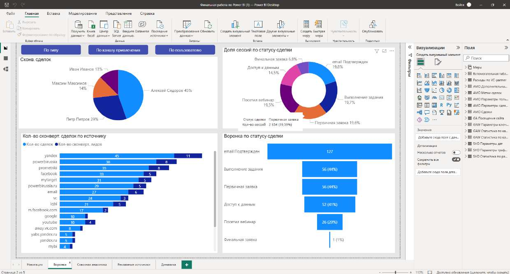
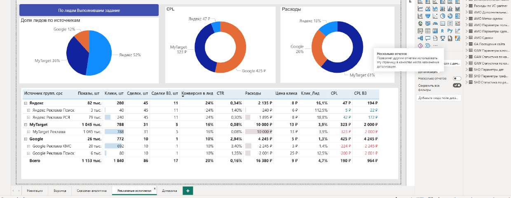

# 📈 Сквозная аналитика: воронка сделок и рекламные каналы

> Дашборд сквозной маркетинговой аналитики: путь от рекламных расходов и кликов →
> к лидам → к сделкам. Воронка по статусам, эффективность каналов (CPL, CTR, конверсия),
> навигация между страницами. **Итоговая (капстоун) работа курса по Power BI.**

**🛠 Стек:** Power BI Desktop · DAX · Data Modeling · Page Navigation
**📁 Файл:** [`report/marketing-funnel-analytics.pbix`](report/) (Git LFS)

> ℹ️ Данные учебные/обезличенные (демо-набор курса).

---

## 📌 Задача

Свести маркетинг и продажи в одном отчёте и ответить на вопросы:

1. Как выглядит **воронка** — где сделки «отваливаются» между статусами?
2. Какие **рекламные источники** приводят конвертирующие лиды, а какие сливают бюджет?
3. Сколько стоит лид (**CPL**) и как отличается эффективность каналов (CTR, конверсия)?
4. Как показатели меняются в **динамике**?

---

## 📄 Страницы отчёта

| Страница | Что показывает |
|---|---|
| **Навигация** | Стартовая страница с переходами (page navigator) — отчёт как приложение |
| **Воронка** | Воронка по статусам сделки (от «первичная заявка» до «финальная»), сделки по менеджерам, конвертирующие сделки по источнику |
| **Сквозная аналитика** | Сводная таблица метрик по каналам «расходы → клики → лиды → сделки» |
| **Рекламные источники** | Разбивка по Яндекс / Google / MyTarget: CPL, CTR, конверсия в лид, расходы |
| **Динамика** | Тренды показателей во времени со слайсерами-фильтрами |

---

## 🎯 Что показывает этот проект

- **Сквозная логика** «деньги → клики → лиды → сделки» в одной модели
- Воронка и разбор точек оттока между статусами
- Метрики эффективности каналов: **CPL, CTR, конверсия, расход**
- **Навигация между страницами** (page navigator, кнопки) — отчёт как готовый продукт, а не набор графиков
- Работа с несколькими источниками данных (реклама + сделки)

---

## ▶️ Как посмотреть

- **С Power BI Desktop:** скачай `report/marketing-funnel-analytics.pbix` (Git LFS) — там все 5 страниц и меры.
- **Без Power BI:** скриншоты страниц выше.
